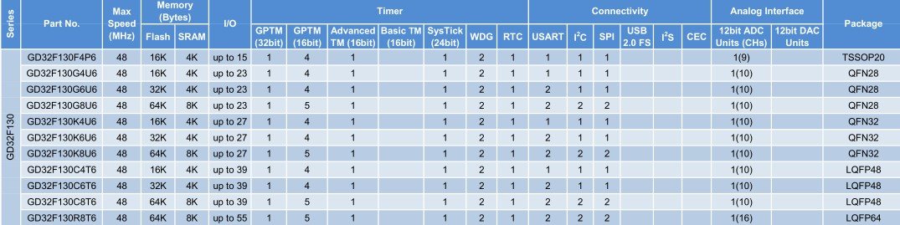

# [GD32F130](https://github.com/sochub/GD32F130)

 

#### 归属：[cortex M3](https://github.com/sochub/CM3)

## [描述](https://github.com/sochub/GD32F130/wiki) 

北京兆易创新STM32F130单片机系列，高性价比产品。

 

## [组成](SoC/) 

#### [文档资料](docs/)

参考设计和数据手册

#### [项目文件](project/)

包括各种开发资源和工程

---

###  [SoC开发平台](http://www.qitas.cn)   

###  qitas@qitas.cn