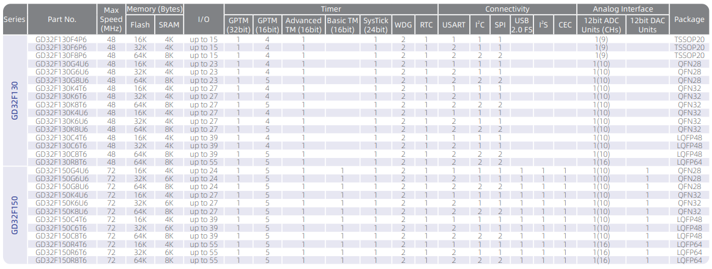

# [GD32F150](https://github.com/SoCXin/GD32F150)

* [GigaDevice](https://www.gigadevice.com/zh-hans)：[Cortex-M3](https://github.com/SoCXin/Cortex)
* [L4R4](https://github.com/SoCXin/Level) ：96 MHz * 1.25 DMIPS/MHz (285CoreMark)

## [简介](https://github.com/SoCXin/GD32F150/wiki)

[GD32F150](https://github.com/SoCXin/GD32F150) 系列

### 关键特性

* USB

#### 封装规格

* QFN32/QFN28
* LQFP64/48
* TSSOP20

### [资源收录](https://github.com/SoCXin)

* [参考文档](docs/)
* [参考资源](src/)
* [参考工程](project/)

### [选型建议](https://github.com/SoCXin)

[GD32F150](https://github.com/SoCXin/GD32F150)

### [探索芯世界 www.SoC.xin](http://www.SoC.Xin)
